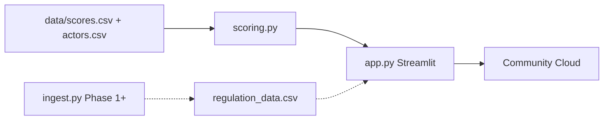

# Italy AI Governance Map

**AI-Powered Regulatory Compliance Monitor** — maps where real AI governance capacity sits in Italy relative to the broader EU AI Act landscape, then evolves toward automated regulatory monitoring.

Italy’s AI governance is fragmented: enforcement concentrated in Rome, an SME-heavy economy, and large digital funds (PNRR/CDP) with limited AI-risk conditionality. This project quantifies institutional capacity across **12 actors × 5 pillars**, applies a dormancy-decay model, and surfaces intervention leverage — with a free/open stack and a path to live compliance monitoring.

> **Live demo:** *[add Streamlit Community Cloud URL after deploy]*  
> **Roadmap:** see [ROADMAP.md](ROADMAP.md)

---

## Architecture

```text
data/*.csv          actor×pillar matrix + metadata (versioned flat files)
        │
        ▼
src/ai_gov_map/
  scoring.py        load_data · compute_scores · compute_heatmap
  ingest.py         Phase 1 — EUR-Lex / OECD / RSS / GDELT (stub)
  dashboard.py      shared UI helpers
        │
        ▼
app.py              Streamlit entry (Briefing · Map · Matrix · Decay · Playbooks)
        │
        ▼
Streamlit Community Cloud (free hosting)
```



---

## Quick start (local)

```bash
cd AI_Governance_map
python3 -m venv .venv
source .venv/bin/activate
pip install -r requirements-dev.txt
streamlit run app.py
```

Optional editable install:

```bash
pip install -e ".[dev]"
```

Run tests:

```bash
pytest -q
```

---

## Deploy (Streamlit Community Cloud)

1. Push this repo to GitHub (public).
2. Go to [share.streamlit.io](https://share.streamlit.io) → **New app**.
3. Select repo / branch `main` / Main file path: `app.py`.
4. Deploy → paste the URL into this README and the GitHub repo **About → Website**.

No secrets required for Phase 0.

---

## What’s in the dashboard

| Page | Purpose |
|------|---------|
| Briefing | Country context + strategic framing |
| Stakeholder Map | Geographic distribution of actors |
| Capacity Matrix | Heatmap across EU AI Act–aligned pillars |
| Decay Simulation | Obsolescence over a chosen horizon |
| Playbooks | Intervention vectors for non-profit capital |

Data lives in `data/scores.csv` and `data/actors.csv` — edit the CSVs, not Python literals.

---

## Stack

- Python 3.10+ · Streamlit · pandas · Plotly / Matplotlib / Seaborn  
- Flat files in git (no database)  
- Planned: GitHub Actions ingest, Ollama/HF summaries, judgment/override log  

Exploratory notebook archived at `notebooks/italy_ai_governance_heatmap_v3.ipynb` (not used at runtime).

---

