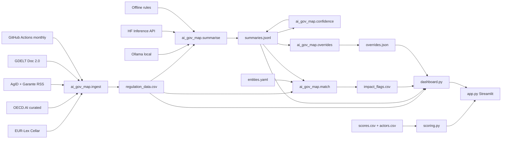

# Italy AI Governance Map

**AI-Powered Regulatory Compliance Monitor** — maps where real AI governance capacity sits in Italy relative to the EU AI Act landscape, then monitors free regulatory signals with an auditable judgement layer.

Italy’s AI governance is fragmented: enforcement concentrated in Rome, an SME-heavy economy, and large digital funds (PNRR/CDP) with limited AI-risk conditionality. This project quantifies institutional capacity across **12 actors × 5 pillars**, applies a dormancy-decay model, and surfaces intervention leverage — then wires a free/open ingest → summarise → match → review loop for compliance monitoring.

> **Live demo:** *[add Streamlit Community Cloud URL after deploy]*  
> **Roadmap:** [ROADMAP.md](ROADMAP.md) · **Changelog:** [CHANGELOG.md](CHANGELOG.md)  
> **Regulation feed:** `data/regulation_data.csv` — refreshed **monthly** via GitHub Actions (and on demand with `workflow_dispatch`)

**Suggested GitHub Topics:** `ai-governance` · `eu-ai-act` · `streamlit` · `italy` · `regulatory-compliance` · `ollama`

---

## Problem

Recruiters and policy teams often see either (a) a static heatmap with no data pipeline, or (b) a scrapey “AI news” dashboard with no judgement trail. This repo aims for the middle:

1. **Capacity map** — who can actually enforce / fund / sandbox AI risk in Italy today?
2. **Regulatory monitor** — what free public sources are saying about the AI Act and Italian institutional signals?
3. **Judgement** — where offline/LLM tags disagree with a human analyst, and why (`overrides.json`).

---

## Architecture

```text
Free sources                Package                         Flat data (git)
─────────────               ─────────                       ───────────────
EUR-Lex SPARQL ─┐           src/ai_gov_map/
OECD.AI (curated)┼─► ingest/ ──► data/raw/ + regulation_data.csv
AgID / Garante ─┤           summarise/ ─► data/summaries.jsonl
GDELT (fallback)┘           match/     ─► impact_flags.csv
                            confidence/ ► needs_review flags
                            overrides/  ► data/overrides.json
                            scoring.py ──► scores.csv
                            dashboard.py
                                   │
                                   ▼
                            app.py (Streamlit)
```



---

## Screenshots / GIF

> **Placeholder** — add after Streamlit Cloud deploy (or a local recording):
>
> 1. Capacity Matrix heatmap (12 × 5)  
> 2. Regulatory Feed timeline + filters  
> 3. Optional 15–30s GIF: filter by entity → export CSV  
>
> Drop files under `docs/` (e.g. `docs/feed.png`) and link them here.

---

## Quick start (local)

```bash
cd AI_Governance_map
python3 -m venv .venv
source .venv/bin/activate
pip install -r requirements-dev.txt
pip install -e .
streamlit run app.py
```

Run tests:

```bash
pytest -q
```

### Refresh regulation data

```bash
python -m ai_gov_map.ingest
# optional: subset of sources
python -m ai_gov_map.ingest --sources eurlex agid garante
```

Writes/merges into `data/regulation_data.csv` (schema: `id,date,title,source,url,jurisdiction,text_excerpt,fetched_at`). Per-source failures are skipped; a total failure **does not wipe** an existing CSV.

### Summarise regulations

```bash
# Auto: Ollama → Hugging Face → offline rules
python -m ai_gov_map.summarise

# Prefer a backend explicitly
python -m ai_gov_map.summarise --backend ollama
python -m ai_gov_map.summarise --backend hf          # needs HF_TOKEN
python -m ai_gov_map.summarise --backend offline     # deterministic; CI / Cloud demo

# Options
python -m ai_gov_map.summarise --dry-run
python -m ai_gov_map.summarise --limit 5
python -m ai_gov_map.summarise -i data/regulation_data.csv -o data/summaries.jsonl
```

Appends JSONL lines keyed by document `id`. Known IDs are **skipped** on later runs (idempotent). Risk tags are closed: `unacceptable` | `high` | `limited` | `minimal`.

| Backend | When | Notes |
|---------|------|--------|
| **Ollama** (primary) | Local `http://localhost:11434` | Tries `llama3.1:8b` / `mistral:7b`. `ollama pull llama3.1:8b` |
| **Hugging Face** | No Ollama; token set | `HF_TOKEN` or `HUGGINGFACE_API_TOKEN`; default model `HuggingFaceH4/zephyr-7b-beta` |
| **Offline rules** | Neither available | Keyword heuristics; always sets `needs_review=true` |

**Streamlit Cloud:** commit `data/summaries.jsonl` (seeded offline for the current feed). The live app reads cached summaries — no Ollama and no HF secret required for demo.

### Entity impact flags

```bash
python -m ai_gov_map.match
python -m ai_gov_map.match --dry-run
python -m ai_gov_map.match --skip-summaries
python -m ai_gov_map.match --entities data/entities.yaml -i data/regulation_data.csv -o data/impact_flags.csv
```

Profiles live in `data/entities.yaml` (**hypothetical / anonymised** demo orgs — not real companies). The matcher is **rules-only**. Output: `data/impact_flags.csv`.

### Confidence + human overrides

```bash
python -m ai_gov_map.confidence
python -m ai_gov_map.confidence --dry-run
python -m ai_gov_map.confidence --write-queue   # companion data/review_queue.jsonl

# Record an override
python -m ai_gov_map.overrides add \
  --id garante:928c6a68df97e0f9 \
  --from high --to minimal \
  --reason "Keyword 'minori' over-fired on a soft G7 communiqué." \
  --by analyst

python -m ai_gov_map.overrides list
python -m ai_gov_map.overrides effective --id garante:928c6a68df97e0f9
```

`effective_tier(doc_id)` returns the override tier when present, else the summary tier — used by the **Regulatory Feed** page.

**Where the model/rules were wrong (examples):**

| id | was → now | reason |
|----|-----------|--------|
| `garante:928c6a68df97e0f9` | high → minimal | Offline keyword `minori` over-fired on a soft G7 principles communiqué — not an Annex III product duty. |
| `gdelt:9e6fd39afb7c737a` | minimal → high | Ausl/sanità digitale AI deployment sits in health Annex III territory; offline news-tone default under-scored it. |
| `eurlex:32024R1689R(04)` | high → minimal | Corrigendum is technical errata, not a new risk classification; CELEX parent-Act heuristic over-applied `high`. |

Full seeded log: eight overrides in [`data/overrides.json`](data/overrides.json).

---

## Dashboard pages

| Page | Purpose |
|------|---------|
| Briefing | Country context + strategic framing |
| Stakeholder Map | Geographic distribution of actors |
| Capacity Matrix | Heatmap across EU AI Act–aligned pillars |
| Decay Simulation | Obsolescence over a chosen horizon |
| Playbooks | Intervention vectors for non-profit capital |
| **Regulatory Feed** | Timeline + entity/tier filters + CSV/JSON export |

Capacity data: `data/scores.csv`, `data/actors.csv`. Regulatory monitor helpers: [`src/ai_gov_map/dashboard.py`](src/ai_gov_map/dashboard.py).

---

## Ingest sources

| Source | Endpoint / approach | Notes |
|--------|---------------------|--------|
| **EUR-Lex** | Cellar SPARQL | EU AI Act CELEX `32024R1689*` |
| **OECD.AI** | Curated public pages | No stable public API — documented fallback |
| **AgID** | RSS | AI-keyword soft filter |
| **Garante** | Privacy authority RSS | Italian institutional signal |
| **GDELT** | Doc 2.0 ArtList (no key) | Noisy fallback; may 429 |

Automation: [`.github/workflows/ingest.yml`](.github/workflows/ingest.yml) — cron `0 6 1 * *` + manual run.  
CI: [`.github/workflows/ci.yml`](.github/workflows/ci.yml) — `pytest` on push/PR.

---

## Live demo (placeholder)

1. Push / merge the phase stack to GitHub (public).
2. Go to [share.streamlit.io](https://share.streamlit.io) → **New app**.
3. Select repo / branch `main` / Main file path: `app.py`.
4. Deploy → paste the URL into this README and the GitHub repo **About → Website**.

No secrets required for Phases 0–6 if you ship cached `data/summaries.jsonl`, `data/impact_flags.csv`, and `data/overrides.json`.

---

## Stack

- Python 3.10+ · Streamlit · pandas · Plotly / Matplotlib / Seaborn · requests · feedparser · PyYAML  
- Flat files in git (no database)  
- GitHub Actions: monthly ingest + pytest CI  
- Summaries: Ollama → HF Inference API → offline rules → `summaries.jsonl`  
- Entity matcher: rules-based keyword/taxonomy → `impact_flags.csv`  
- Judgement: confidence heuristics + human overrides → `overrides.json`  
- Monitor UI: `dashboard.py` → Regulatory Feed page  

Exploratory notebook archived at `notebooks/italy_ai_governance_heatmap_v3.ipynb` (not used at runtime).

---

## Limitations & what I'd improve

Honest constraints (interview framing — not a legal product):

- **Static capacity matrix** — actor×pillar scores are curated CSVs, not derived from the regulation feed. Wiring ingest signals into capacity updates would be the next research step.
- **OECD.AI has no reliable public API** — Phase 1 uses curated public-page URLs, not scraped HTML tables that break monthly.
- **GDELT is rate-limited and noisy** — secondary signal only; expect 429s under load.
- **Seeded summaries use offline rules** — good for Cloud/demo determinism; re-run with Ollama/HF locally for higher-quality text. Heuristics + invalid tags set `needs_review`.
- **Impact flags are heuristic** — keyword/taxonomy overlap, not a legal opinion. Entities are hypothetical.
- **Overrides are analyst judgements for demo** — eight seeded disagreements show where rules over/under-fired; not formal classifications.
- **No live Streamlit URL yet** — deploy is a manual Cloud step after the branch stack lands on `main`.
- **What I'd improve next:** (1) diff-aware ingest PRs instead of bot commits on `main`, (2) light embedding retrieval for entity match, (3) capacity score provenance from regulation events, (4) screenshots + a short Loom walkthrough of override examples.

See [ROADMAP.md](ROADMAP.md) for the full build path and remaining gate checklist.
