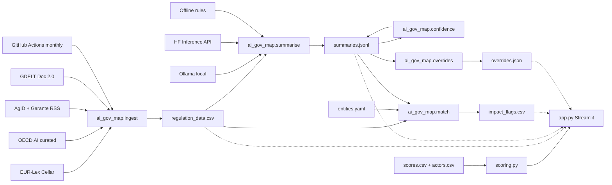

# Italy AI Governance Map

**AI-Powered Regulatory Compliance Monitor** — maps where real AI governance capacity sits in Italy relative to the broader EU AI Act landscape, then evolves toward automated regulatory monitoring.

Italy’s AI governance is fragmented: enforcement concentrated in Rome, an SME-heavy economy, and large digital funds (PNRR/CDP) with limited AI-risk conditionality. This project quantifies institutional capacity across **12 actors × 5 pillars**, applies a dormancy-decay model, and surfaces intervention leverage — with a free/open stack and a path to live compliance monitoring.

> **Live demo:** *[add Streamlit Community Cloud URL after deploy]*  
> **Roadmap:** see [ROADMAP.md](ROADMAP.md)  
> **Regulation feed:** `data/regulation_data.csv` — refreshed **monthly** via GitHub Actions (and on demand with `workflow_dispatch`)

---

## Architecture

```text
Free sources                Package                         Flat data (git)
─────────────               ─────────                       ───────────────
EUR-Lex SPARQL ─┐           src/ai_gov_map/
OECD.AI (curated)┼─► ingest/ ──► data/raw/ + regulation_data.csv
AgID / Garante ─┤           summarise/ ─► data/summaries.jsonl
GDELT (fallback)┘           match/     ─► data/impact_flags.csv
                            confidence/ ► needs_review flags
                            overrides/  ► data/overrides.json
                            scoring.py ──► scores.csv
                            dashboard.py
                                   │
                                   ▼
                            app.py (Streamlit)
```



---

## Quick start (local)

```bash
cd AI_Governance_map
python3 -m venv .venv
source .venv/bin/activate
pip install -r requirements-dev.txt
pip install -e .
streamlit run app.py
```

Run tests:

```bash
pytest -q
```

### Refresh regulation data

```bash
python -m ai_gov_map.ingest
# optional: subset of sources
python -m ai_gov_map.ingest --sources eurlex agid garante
```

Writes/merges into `data/regulation_data.csv` (schema: `id,date,title,source,url,jurisdiction,text_excerpt,fetched_at`). Per-source failures are skipped; a total failure **does not wipe** an existing CSV.

### Summarise regulations (Phase 2)

```bash
# Auto: Ollama → Hugging Face → offline rules
python -m ai_gov_map.summarise

# Prefer a backend explicitly
python -m ai_gov_map.summarise --backend ollama
python -m ai_gov_map.summarise --backend hf          # needs HF_TOKEN
python -m ai_gov_map.summarise --backend offline     # deterministic; CI / Cloud demo

# Options
python -m ai_gov_map.summarise --dry-run
python -m ai_gov_map.summarise --limit 5
python -m ai_gov_map.summarise -i data/regulation_data.csv -o data/summaries.jsonl
```

Appends JSONL lines keyed by document `id` (`summary`, `risk_tier`, `rationale`, `model`, `created_at`, plus `confidence` / `needs_review` placeholders for Phase 4). Known IDs are **skipped** on later runs (idempotent). Risk tags are closed: `unacceptable` | `high` | `limited` | `minimal`.

| Backend | When | Notes |
|---------|------|--------|
| **Ollama** (primary) | Local `http://localhost:11434` | Tries `llama3.1:8b` / `mistral:7b`. `ollama pull llama3.1:8b` |
| **Hugging Face** | No Ollama; token set | `HF_TOKEN` or `HUGGINGFACE_API_TOKEN`; default model `HuggingFaceH4/zephyr-7b-beta` (override with `HF_SUMMARISE_MODEL`) |
| **Offline rules** | Neither available | Keyword heuristics; always sets `needs_review=true` |

**Streamlit Cloud:** commit `data/summaries.jsonl` (seeded offline for the current feed). The live app should read cached summaries — no Ollama and no HF secret required for demo.

### Entity impact flags (Phase 3)

```bash
# Rewrite data/impact_flags.csv from entities + regulations (+ optional summaries)
python -m ai_gov_map.match

# Options
python -m ai_gov_map.match --dry-run
python -m ai_gov_map.match --skip-summaries
python -m ai_gov_map.match --entities data/entities.yaml -i data/regulation_data.csv -o data/impact_flags.csv
```

Profiles live in `data/entities.yaml` (**hypothetical / anonymised** demo orgs — not real companies). The matcher is **rules-only** (keyword + use-case/sector taxonomy overlap; optional `risk_tier` from `summaries.jsonl`). Output schema: `regulation_id,entity_id,match_score,matched_terms,risk_tier,reason,flagged_at`. Full CSV rewrite is deterministic for fixed inputs (`flagged_at` defaults to each regulation’s `fetched_at`).

### Judgement layer (Phase 4)

Confidence heuristics re-flag summaries that need a human look (hedging language, conflicting/ambiguous dates, `risk_tier` outside the closed taxonomy, or low backend confidence). The summarise path applies the same logic on write; batch re-flag refreshes existing JSONL **without** regenerating text:

```bash
python -m ai_gov_map.confidence
python -m ai_gov_map.confidence --dry-run
python -m ai_gov_map.confidence --write-queue   # companion data/review_queue.jsonl
```

Human overrides live in `data/overrides.json` (interview material — where offline rules were wrong or too blunt):

```bash
# Record an override
python -m ai_gov_map.overrides add \
  --id garante:928c6a68df97e0f9 \
  --from high --to minimal \
  --reason "Keyword 'minori' over-fired on a soft G7 communiqué." \
  --by analyst

python -m ai_gov_map.overrides list
python -m ai_gov_map.overrides effective --id garante:928c6a68df97e0f9
```

`effective_tier(doc_id)` returns the override tier when present, else the summary tier (ready for Phase 5 dashboard).

**Where the model/rules were wrong (examples):**

| id | was → now | reason |
|----|-----------|--------|
| `garante:928c6a68df97e0f9` | high → minimal | Offline keyword `minori` over-fired on a soft G7 principles communiqué — not an Annex III product duty. |
| `gdelt:9e6fd39afb7c737a` | minimal → high | Ausl/sanità digitale AI deployment sits in health Annex III territory; offline news-tone default under-scored it. |
| `eurlex:32024R1689R(04)` | high → minimal | Corrigendum is technical errata, not a new risk classification; CELEX parent-Act heuristic over-applied `high`. |

Full seeded log: eight overrides in [`data/overrides.json`](data/overrides.json).

---

## Ingest sources (Phase 1)

| Source | Endpoint / approach | Notes |
|--------|---------------------|--------|
| **EUR-Lex** | Cellar SPARQL (`publications.europa.eu/webapi/rdf/sparql`) | EU AI Act CELEX `32024R1689*` → EUR-Lex TXT links; raw JSON under `data/raw/` |
| **OECD.AI** | Curated public pages (no stable public API) | Italy national dashboard + Observatory overview + EC AI framework page for EU vs Italy comparison |
| **AgID** | `https://www.agid.gov.it/it/rss.xml` | Italian digital-agency news; AI-keyword soft filter |
| **Garante** | `https://www.garanteprivacy.it/o/gpdp-rss/rss?t=news` | Privacy authority news RSS |
| **GDELT** | Doc 2.0 ArtList (no key) | Noisy fallback; hard-filtered for AI Act / governance terms; may 429 under load |

Automation: [`.github/workflows/ingest.yml`](.github/workflows/ingest.yml) — cron `0 6 1 * *` + manual run; installs package, runs ingest + pytest, commits `regulation_data.csv` when changed (`contents: write`).

---

## Deploy (Streamlit Community Cloud)

1. Push this repo to GitHub (public).
2. Go to [share.streamlit.io](https://share.streamlit.io) → **New app**.
3. Select repo / branch `main` / Main file path: `app.py`.
4. Deploy → paste the URL into this README and the GitHub repo **About → Website**.

No secrets required for Phases 0–4 if you ship cached `data/summaries.jsonl`, `data/impact_flags.csv`, and `data/overrides.json`. Optional: set `HF_TOKEN` only if you want live HF summarisation in Actions/Cloud.

---

## What’s in the dashboard

| Page | Purpose |
|------|---------|
| Briefing | Country context + strategic framing |
| Stakeholder Map | Geographic distribution of actors |
| Capacity Matrix | Heatmap across EU AI Act–aligned pillars |
| Decay Simulation | Obsolescence over a chosen horizon |
| Playbooks | Intervention vectors for non-profit capital |

Capacity data lives in `data/scores.csv` and `data/actors.csv`. Regulatory items accumulate in `data/regulation_data.csv` (timeline UI lands in Phase 5).

---

## Stack

- Python 3.10+ · Streamlit · pandas · Plotly / Matplotlib / Seaborn · requests · feedparser  
- Flat files in git (no database)  
- GitHub Actions monthly ingest (free on public repos)  
- Summaries: Ollama → HF Inference API → offline rules → `data/summaries.jsonl`  
- Entity matcher: rules-based keyword/taxonomy → `data/impact_flags.csv` (Phase 3)  
- Judgement: confidence heuristics + human overrides → `data/overrides.json` (Phase 4)

Exploratory notebook archived at `notebooks/italy_ai_governance_heatmap_v3.ipynb` (not used at runtime).

---

## Limitations & next

- Capacity heatmap still uses a curated static matrix; regulation CSV / summaries are separate until Phase 5 wires them into the UI.  
- OECD.AI has **no reliable public API** — Phase 1 uses a documented curated-page fallback, not scraped HTML tables.  
- GDELT is rate-limited and noisy; treat it as a secondary signal.  
- Seeded summaries use the offline rule backend; re-run with Ollama/HF locally for higher-quality text. Heuristics + invalid model tags set `needs_review`.  
- Impact flags are heuristic (keyword/taxonomy); not a legal opinion. Entities are hypothetical.  
- Overrides are analyst judgements for demo/interview — not formal legal classifications.  
- Timeline / filter / export UI is next (Phase 5).  
- See [ROADMAP.md](ROADMAP.md) for the full build path.
